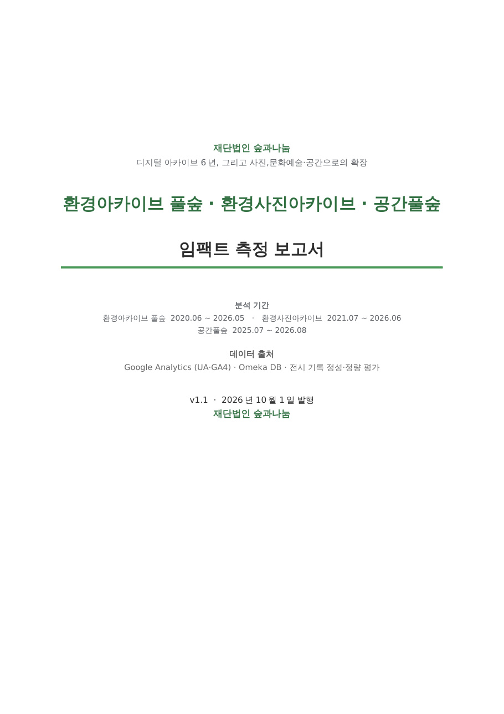

# 환경아카이브 풀숲 임팩트 측정 2026

재단법인 숲과나눔이 운영하는 **환경아카이브 풀숲**(https://ecoarchive.org)의 임팩트 측정 프로젝트 저장소입니다. 두 가지를 공개합니다.

1. **임팩트 측정 보고서** (v1.0, 2026-10-01 발행)와 그 작성에 쓴 데이터·그림·스크립트
2. **풀숲 데이터 랩** — Omeka 전수 111,106건을 컬렉션·시간·주제·지역·키워드로 분석한 공개 사이트와 그 데이터

<table><tr>
<td width="220" valign="top"><a href="report/pulsoop-impact-report-2026-v1.0.pdf"></a></td>
<td valign="top">

**환경아카이브 풀숲 · 환경사진아카이브 · 공간풀숲 임팩트 측정 보고서**<br>
재단법인 숲과나눔 · v1.0 · 2026년 10월 1일 · 82쪽

디지털 아카이브 6년, 그리고 사진·공간으로의 확장. 풀숲 6년의 접속통계, 환경사진아카이브 5년의 이용현황, 공간풀숲 1년의 전시 성과, 전문가 인터뷰, Omeka 전수 소장현황 분석을 하나의 임팩트 틀로 종합했습니다.

📄 [PDF 내려받기 (5.2MB)](report/pulsoop-impact-report-2026-v1.0.pdf) · [웹에서 보기](https://archivelabedu.github.io/ecoarchive-impact2026/report/pulsoop-impact-report-2026-v1.0.pdf)<br>
🌐 풀숲 데이터 랩: **https://archivelabedu.github.io/ecoarchive-impact2026/**<br>
📊 보고서 데이터: [`data/impact/`](data/impact/) · 소장현황 데이터: [`data/holdings/`](data/holdings/)

</td></tr></table>

## 저장소 구성

```
ecoarchive-impact2026/
├─ report/          보고서 PDF, 표지 이미지
├─ data/
│   ├─ holdings/    데이터 랩 사이트 데이터 (Omeka 전수 집계 JSON 17종)
│   └─ impact/      보고서 데이터 패키지 (원자료 · 정제 CSV · 그림 · 스크립트 · README)
├─ templates/       사이트 페이지 템플릿 (Jinja2)
├─ content/         사이트 산문 (방법 · 소개 · 시대 서술 · 컬렉션 소개문)
├─ assets/          CSS, ECharts 헬퍼
├─ scripts/         수집 · 집계 · 빌드 스크립트
└─ docs/            빌드된 사이트 (GitHub Pages)
```

## 데이터 설명

### `data/holdings/` — 소장현황 데이터 (Omeka 전수, 2026-09-10)

환경아카이브 풀숲 Omeka Classic REST API로 전수 수집한 111,106건(공개 95,474건)을 집계한 JSON입니다. 사이트의 모든 그래프가 이 파일에서 그려집니다.

| 파일 | 내용 |
|---|---|
| `summary.json` | 핵심 수치 (등록·공개·컬렉션·원문 제공률·키워드·생산자·공공기관 문서 등) |
| `holdings.json` | 기록유형·형태·원본형태·언어, 연도·연대·주제 분포, 지역 분포(추정), 필드 충족률, 월별 등록 추이 |
| `collections.json` | 컬렉션 34개 상세 — 유형·연도·주제·지역·상위/특징 키워드·외부 생산자·연관 컬렉션·품질·대표 기록 |
| `keywords_windows.json` | 5년 단위 상위·특징 키워드 (한겨레 컬렉션 제외) |
| `keywords_series.json` | 상위 400 키워드의 연도별 건수 |
| `keywords_life.json` | 키워드 등장·정점·퇴장 연도 |
| `keywords_change.json` | 연대 사이의 급상승·급락 키워드 (가산 보정 log₂ 비율) |
| `keywords_cooc.json` | 키워드 공출현 네트워크 (상위 150) |
| `keywords_dict.json` | 키워드 사전 (3건 이상, 11,670개) |
| `org_keywords.json` | 단체 컬렉션 × 공통 키워드 |
| `network.json` | 생산자→기증주체 그래프, 공공기관 생산 문서, 정책 대응 기록 |
| `timeline.json` | 환경운동 40년 — 연도별 스트립, 다섯 시대, 사건 47건의 관련 기록, 조직 542건, 연표 |
| `events.json`, `orgs.json`, `chronology.json` | 정보사전 사건·조직·연표 집계 |
| `photos.json` | 작품사진 9,183건 집계 (촬영연도·지역·라이선스·작가·매체) |
| `season.json` | 생산 월 분포 |

산출 기준과 유의사항(지역 추정, 특징 키워드 정의, 한겨레 컬렉션 제외 등)은 사이트의 [데이터·방법](https://archivelabedu.github.io/ecoarchive-impact2026/data/index.html) 페이지에 있습니다. 필드가 평탄화된 전수 원자료(JSONL, gzip)는 [Releases](https://github.com/ArchivelabEdu/ecoarchive-impact2026/releases)에 있습니다.

### `data/impact/` — 임팩트 측정 보고서 데이터

보고서 Ⅱ~Ⅳ부(접속통계·환경사진아카이브·공간풀숲)의 원자료와 정제 표, 보고서 수록 그림 24종, 그림 생성·조판 스크립트입니다. 상세 목록은 [`data/impact/README.md`](data/impact/README.md)를 보십시오.

| 폴더 | 내용 |
|---|---|
| `raw/` | 원자료 엑셀 3종 — Google Analytics(풀숲 2025-26, 환경사진아카이브 2021-26), 공간풀숲 전시 기록 |
| `processed/` | 원자료 시트별 CSV와 보고서 수록 정제 표 (운영연도별 이용자, 유입 채널, 검색어, 연령·기기·국가, 웹진 목록, 전시 성과 등) |
| `figures/` | 보고서 그림 fig01~fig24 PNG와 캡션(`captions.json`) |
| `scripts/` | 그림 생성(`make_figs.py`)과 docx 조판 스크립트 |

공간풀숲 전시 기록의 정성자료(관람객 후기·방명록·SNS 댓글)는 재단의 검토를 거쳐 공개합니다. 인용 시 작성자를 특정하지 않도록 유의하시기 바랍니다.

## 사용법

### 데이터 읽기

```python
import json, pandas as pd

# 소장현황: 컬렉션별 요약
cols = json.load(open("data/holdings/collections.json", encoding="utf-8"))
df = pd.DataFrame([{k: c[k] for k in ("name", "kind", "total", "public", "year_min", "year_max", "share_2020s")} for c in cols])

# 소장현황: 연도별 생산 기록 수
h = json.load(open("data/holdings/holdings.json", encoding="utf-8"))
by_year = pd.DataFrame(h["year"])          # k=연도, v=건수

# 보고서 데이터: 풀숲 운영연도별 이용자
ga = pd.read_csv("data/impact/processed/pulsoop_yearly_2020-2026.csv")
```

### 사이트 다시 만들기

```bash
python3 -m venv venv && venv/bin/pip install pandas jinja2 markdown
venv/bin/python scripts/omeka_api_pull.py <OMEKA_API_KEY>   # 전수 수집 (약 10분)
venv/bin/python scripts/omeka_full_build.py                 # 평탄화·파생 필드
venv/bin/python scripts/site_data.py                        # data/holdings/*.json
venv/bin/python scripts/timeline_data.py                    # data/holdings/timeline.json
venv/bin/python scripts/build.py                            # docs/ 생성
```

macOS에서 한글 소스를 실행할 때는 `LC_ALL=en_US.UTF-8`을 설정하십시오. `docs/`를 커밋해 푸시하면 GitHub Pages(main 브랜치 `/docs`)로 배포됩니다.

## 인용

> 재단법인 숲과나눔·아카이브랩 (2026). 환경아카이브 풀숲·환경사진아카이브·공간풀숲 임팩트 측정 보고서 v1.0. https://github.com/ArchivelabEdu/ecoarchive-impact2026

## 라이선스

- 집계 데이터(`data/holdings/`, `data/impact/processed/`)와 그래프: CC BY 4.0
- 소스코드: MIT
- 보고서 PDF: © 재단법인 숲과나눔. 출처를 밝히고 비영리 목적으로 자유롭게 인용·공유할 수 있습니다.
- 원자료(기록·사진·GA 통계)의 권리는 각 기증주체와 재단법인 숲과나눔에 있으며 풀숲 이용약관을 따릅니다.

## 만든 사람

재단법인 숲과나눔(환경아카이브 풀숲 운영) · 아카이브랩(분석·사이트 구축). 문의: koreashe@koreashe.org
